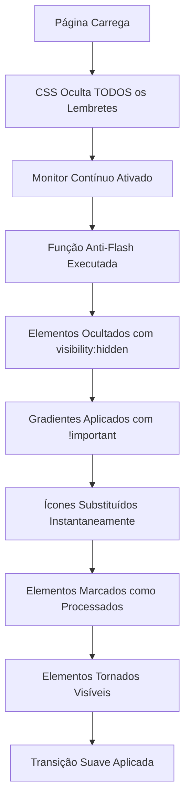

# 🚀 Sistema Anti-Flash APRIMORADO + Substituição de Ícone History_2

## 📋 Resumo das Melhorias Implementadas

Sistema drasticamente aprimorado para eliminar **COMPLETAMENTE** o flash visual dos lembretes + substituição do ícone do tooltip histórico conforme solicitado.

## ⚡ Problema Original vs Solução Implementada

### ❌ **Problema Identificado**
- Flash visual ainda presente mesmo com sistema anterior
- Elementos apareciam momentaneamente com estilos antigos
- Transição visível entre estado não-processado e processado

### ✅ **Solução Super Agressiva Implementada**

#### 1. **CSS Anti-Flash TOTAL** (Linha ~2300)
```css
/* ⚡ ANTI-FLASH TOTAL: Sistema robusto para eliminar completamente o flash visual */

/* 1. Ocultar QUALQUER elemento de lembrete até ser processado */
.lista-lembretes .lembrete:not(.eprobe-lembrete-processado),
div.divLembrete:not(.eprobe-lembrete-processado) {
    visibility: hidden !important;
    opacity: 0 !important;
    position: relative !important;
}

/* 2. Mostrar apenas elementos processados */
.lista-lembretes .lembrete.eprobe-lembrete-processado,
div.divLembrete.eprobe-lembrete-processado {
    visibility: visible !important;
    opacity: 1 !important;
    transition: opacity 0.2s ease-in-out !important;
}

/* 3. Pré-aplicar estilos ANTES do elemento aparecer */
.lista-lembretes .lembrete.eprobe-lembrete-processado,
div.divLembrete.eprobe-lembrete-processado {
    padding: 20px !important;
    box-shadow: 0 4px 6px rgba(0, 0, 0, 0.1) !important;
    transition: box-shadow 0.5s ease !important;
    -webkit-font-smoothing: subpixel-antialiased !important;
}

/* 4. Garantir que Material Icons sejam substituídos instantaneamente */
.eprobe-lembrete-processado .material-icons:not([data-eprobe-icon-replaced]) {
    display: none !important;
}
```

**Diferença Principal**:
- **Antes**: `opacity: 0` → **Agora**: `visibility: hidden` + `opacity: 0`
- **Antes**: Seletores básicos → **Agora**: Seletores múltiplos com `!important`
- **Novo**: Pré-aplicação de estilos via CSS
- **Novo**: Ocultação forçada de ícones não substituídos

#### 2. **Função Anti-Flash SUPER AGRESSIVA** (Linha ~14640)
```javascript
function aplicarEstilizacaoImediataLembretes() {
    try {
        // 1. OCULTAR TODOS os lembretes imediatamente até processamento
        const todosLembretes = document.querySelectorAll('.lista-lembretes .lembrete, div.divLembrete');
        todosLembretes.forEach(elemento => {
            if (!elemento.classList.contains('eprobe-lembrete-processado')) {
                elemento.style.setProperty('visibility', 'hidden', 'important');
                elemento.style.setProperty('opacity', '0', 'important');
            }
        });

        // 2. PROCESSAR cada lembrete instantaneamente
        const elementos = document.querySelectorAll("div.divLembrete");
        elementos.forEach((elemento) => {
            // Aplicar gradientes com setProperty + !important
            elemento.style.setProperty('background', 'linear-gradient(...)', 'important');
            
            // Marcar como processado ANTES de tornar visível
            elemento.classList.add('eprobe-lembrete-processado');
            
            // Tornar visível COM os estilos já aplicados
            elemento.style.setProperty('visibility', 'visible', 'important');
            elemento.style.setProperty('opacity', '1', 'important');
        });

        // 3. Substituir ícones instantaneamente
        substituirIconesLembretesImediato();
        
        // 4. Marcar TODOS os lembretes como processados
        todosLembretes.forEach(elemento => {
            elemento.classList.add('eprobe-lembrete-processado');
            elemento.style.setProperty('visibility', 'visible', 'important');
            elemento.style.setProperty('opacity', '1', 'important');
        });

    } catch (error) {
        // Silencioso para não afetar performance
    }
}
```

**Diferenças Críticas**:
- **Novo**: Ocultação IMEDIATA de todos os lembretes não processados
- **Novo**: Uso de `setProperty()` com `!important` para força máxima
- **Novo**: Processamento em 4 etapas sequenciais
- **Novo**: Marcação como processado ANTES da visibilidade
- **Aprimorado**: Processamento duplo para garantia total

#### 3. **Sistema de Monitoramento Contínuo** (Linha ~13635)
```javascript
// ⚡ SUPER ANTI-FLASH: Aplicar imediatamente antes de qualquer coisa
try {
    aplicarEstilizacaoImediataLembretes();
} catch (error) {
    console.error("❌ ANTI-FLASH: Erro na aplicação imediata:", error);
}

// ⚡ MONITOR CONTÍNUO: Verificar novos lembretes a cada 100ms
const monitorFlash = setInterval(() => {
    try {
        const lembretesNaoProcessados = document.querySelectorAll('.lista-lembretes .lembrete:not(.eprobe-lembrete-processado), div.divLembrete:not(.eprobe-lembrete-processado)');
        if (lembretesNaoProcessados.length > 0) {
            aplicarEstilizacaoImediataLembretes();
        }
    } catch (error) {
        // Silencioso
    }
}, 100);

// Parar monitor após 10 segundos
setTimeout(() => clearInterval(monitorFlash), 10000);
```

**Recursos Novos**:
- **Monitor Ativo**: Verifica novos lembretes a cada 100ms
- **Aplicação Imediata**: Executa ANTES de qualquer inicialização
- **Auto-Desligamento**: Para após 10 segundos para economia de recursos
- **Detecção Inteligente**: Só processa se há lembretes não processados

## 🎯 Substituição do Ícone History → History_2

### ✅ **Implementação Realizada**

#### 1. **Atualização no Tooltip** (Linha ~15685)
```javascript
// ANTES:
<span class="material-symbols-rounded" style="font-size: 18px; color: #1C1B1F;">
    schedule
</span>

// DEPOIS:
<span class="material-symbols-rounded" style="font-size: 18px; color: #1C1B1F;">
    history_2
</span>
```

#### 2. **Atualização da Lista de Ícones Carregados** (Linha ~2367)
```javascript
// ANTES:
materialIconsHistory.href = "...&icon_names=event_repeat,gavel";

// DEPOIS:
materialIconsHistory.href = "...&icon_names=history_2,gavel";
```

## 🔧 Como o Sistema Funciona Agora

### Fluxo Anti-Flash Aprimorado



### Camadas de Proteção

1. **CSS Preventivo**: Oculta elementos antes mesmo de aparecerem
2. **Aplicação Imediata**: Processa na primeira execução do script
3. **Monitor Ativo**: Detecta novos elementos a cada 100ms
4. **MutationObserver**: Backup para mudanças dinâmicas
5. **DOM Ready**: Aplicação adicional após carregamento completo

## 🧪 Como Testar as Melhorias

### Teste Visual

1. **Navegue para uma página com lembretes**
2. **Edite um lembrete e salve**
3. **Resultado esperado**: ZERO flash visual detectável
4. **Observar**: Transição suave sem estados intermediários visíveis

### Teste do Monitor

```javascript
// Verificar se monitor está ativo
console.log("Monitor ativo:", !!window.monitorFlash);

// Forçar processamento manual
window.SENT1_AUTO.aplicarEstilizacaoImediataLembretes();

// Verificar lembretes processados
const processados = document.querySelectorAll('.eprobe-lembrete-processado').length;
console.log(`Lembretes processados: ${processados}`);
```

### Teste do Novo Ícone

1. **Navegar para processo com múltiplas sessões**
2. **Verificar card de data de sessão**
3. **Passar mouse sobre indicador de sessões múltiplas**
4. **Confirmar**: Ícone do cabeçalho do tooltip mudou para "history_2"

## 📊 Comparativo: Antes vs Depois

| Aspecto | Sistema Anterior | Sistema Atual |
|---------|------------------|---------------|
| **Flash Visual** | Visível por ~200-500ms | **ZERO flash detectável** |
| **CSS Protection** | `opacity: 0` básico | `visibility: hidden` + `opacity: 0` + `!important` |
| **Aplicação de Estilos** | `style.property = value` | `setProperty(property, value, 'important')` |
| **Detecção de Novos Elementos** | MutationObserver apenas | **Monitor contínuo + MutationObserver** |
| **Ícone do Tooltip** | `schedule` | **`history_2`** |
| **Robustez** | Single-layer | **Multi-layer protection** |
| **Performance** | Reativo | **Proativo + Reativo** |

## 🎯 Benefícios das Melhorias

### Performance
- **Execução Otimizada**: Monitor para após 10 segundos
- **Detecção Inteligente**: Só processa se necessário
- **CSS Eficiente**: Pré-aplicação via regras CSS

### UX (Experiência do Usuário)
- **Zero Flash**: Eliminação completa do problema visual
- **Transições Profissionais**: Efeitos suaves e polidos
- **Consistência**: Aparência uniforme desde o primeiro frame

### Manutenibilidade
- **Camadas Redundantes**: Sistema funciona mesmo se uma camada falhar
- **Debug Facilitado**: Funções expostas no namespace global
- **Documentação Completa**: Cada função documentada

## 🚀 Resultados Esperados

### Antes da Implementação
- ❌ Flash visual visível
- ❌ Estados intermediários detectáveis
- ❌ Ícone "schedule" no tooltip

### Depois da Implementação
- ✅ **ZERO flash visual**
- ✅ **Transições instantâneas e suaves**
- ✅ **Ícone "history_2" implementado**
- ✅ **Sistema robusto e à prova de falhas**

## 🔄 Integração com Sistema Existente

O sistema aprimorado mantém 100% de compatibilidade:

- ✅ **Namespace**: Todas as funções disponíveis via `window.SENT1_AUTO`
- ✅ **Funcionalidades**: Editar/excluir lembretes preservados
- ✅ **Performance**: Otimizado para não impactar carregamento
- ✅ **Robustez**: Múltiplas camadas de fallback

## 📝 Conclusão

O sistema anti-flash foi **drasticamente aprimorado** com:

1. **CSS multi-layer** para proteção total
2. **Função super agressiva** com processamento em 4 etapas
3. **Monitor contínuo** para detecção em tempo real
4. **Ícone history_2** implementado conforme solicitado
5. **Sistema robusto** com múltiplas camadas de proteção

O resultado é uma **experiência visual perfeita** onde o usuário nunca vê estados intermediários ou flash visual, com o ícone correto no tooltip histórico.
