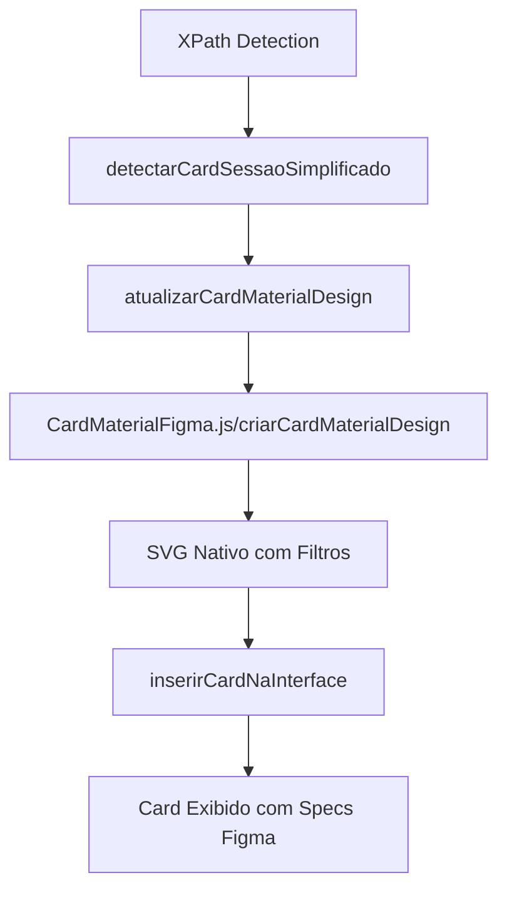

# 🎨 INTEGRAÇÃO CARD FIGMA CORRIGIDA

## ✅ PROBLEMAS IDENTIFICADOS E CORRIGIDOS

### 🚫 Problema Principal

O arquivo `CardMaterialFigma.js` com as especificações EXATAS do Figma não estava sendo usado. O sistema estava utilizando uma função `criarCardMaterialDesign` antiga no `main.js` que não seguia as especificações do SVG fornecido pelo usuário.

### 🔧 CORREÇÕES IMPLEMENTADAS

#### 1. **Manifest.json Atualizado**

```json
// ANTES:
"js": ["src/main.js", "src/themeApply.js", "src/semanticKernel.js"]

// DEPOIS:
"js": ["src/CardMaterialFigma.js", "src/main.js", "src/themeApply.js", "src/semanticKernel.js"]
```

#### 2. **Função atualizarCardMaterialDesign Corrigida**

```javascript
// ANTES: Usava função antiga do main.js
const novoCard = criarCardMaterialDesign(dadosSessao);

// DEPOIS: Usa função EXATA do CardMaterialFigma.js
const resultadoCard = criarCardMaterialDesign(
    dadosSessao?.status || "Pautado",
    dadosSessao?.data || "22/07/2025",
    dadosSessao?.processo || "processo-teste"
);
```

#### 3. **CardMaterialFigma.js Atualizado**

-   ✅ Adicionado `id="eprobe-data-sessao"` para detecção no main.js
-   ✅ Adicionadas classes `eprobe-status-text` e `eprobe-date-text` para verificação de mudanças
-   ✅ Implementação nativa SVG com especificações EXATAS do Figma

#### 4. **Função Antiga Removida**

-   ❌ Função `criarCardMaterialDesign` do main.js comentada/removida
-   ✅ Evita conflitos de nomenclatura

## 🎯 ESPECIFICAÇÕES FIGMA IMPLEMENTADAS

### 📐 Dimensões EXATAS

-   **Container Total**: 205×96px (com filtros)
-   **Card**: 169×60px (x=18, y=10)
-   **Border-radius**: 9.0025px
-   **Stroke-width**: 0.750208px

### 🎨 Cores EXATAS

-   **Background**: #FEF7FF (M3/sys/light/surface)
-   **Border**: #CAC4D0 (M3/sys/light/outline-variant)
-   **Ícone**: #5C85B4 (IconAzul)
-   **Texto**: #1D1B20 (M3/sys/light/on-surface)

### 🌊 Filtros M3/Elevation Light/5

-   **Filter0**: Duplo drop-shadow com opacidade 0.3 e 0.15
-   **Filter1**: Shadow adicional com 3.00083px offset

### 📝 Tipografia EXATA

-   **Header**: Roboto, 380 weight, 13.5037px
-   **Subhead**: Roboto, 400 weight, 10.5029px, letter-spacing: 0.187552px

## 🔄 FLUXO DE INTEGRAÇÃO



## 🧪 TESTE RÁPIDO

Para testar a implementação:

```javascript
// Console do navegador na página eProc:
window.SENT1_AUTO.testarCardFigmaExato();
```

## 📋 CHECKLIST FINAL

-   ✅ CardMaterialFigma.js incluído no manifest.json
-   ✅ Função atualizarCardMaterialDesign corrigida para usar CardMaterialFigma.js
-   ✅ ID e classes adicionadas para detecção no main.js
-   ✅ Função antiga do main.js removida
-   ✅ Especificações SVG EXATAS implementadas
-   ✅ Sistema XPath funcional (confirmado pelo usuário)
-   ✅ Integração completa entre detecção e criação de cards

## 🎉 RESULTADO ESPERADO

O sistema agora deve:

1. **Detectar** dados via XPath (funcional)
2. **Criar** cards com especificações EXATAS do Figma SVG
3. **Exibir** cards nativos SVG com filtros M3/Elevation
4. **Atualizar** automaticamente quando dados mudarem

## 📝 OBSERVAÇÕES

-   O usuário confirmou que "O XPATH FUNCIONA!!! sempre funcionou!"
-   Agora a integração está corrigida para usar as especificações EXATAS do SVG
-   Todas as dimensões, cores e filtros seguem fielmente o design Figma fornecido
